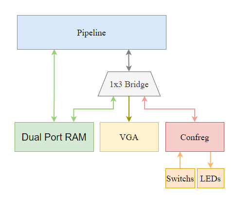
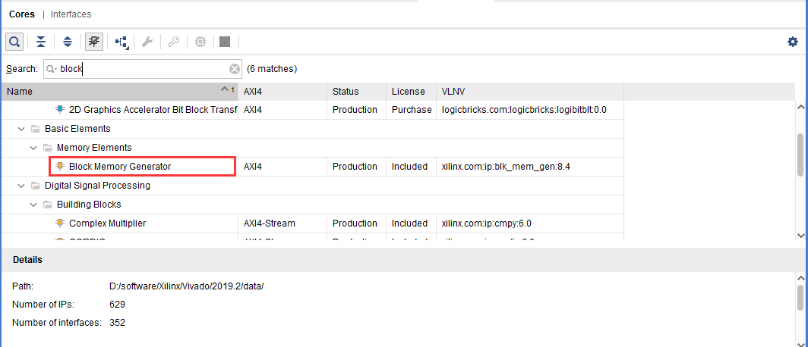
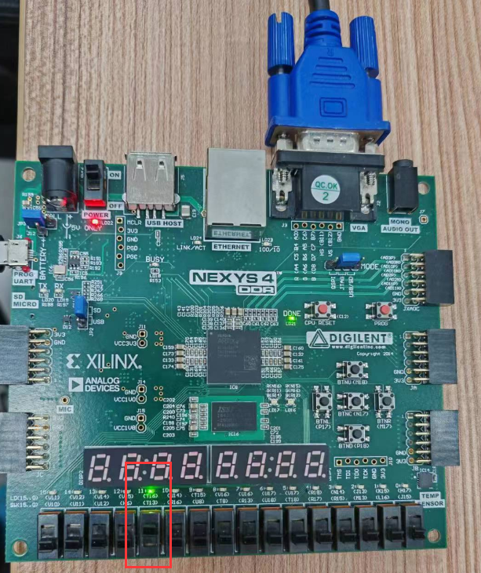
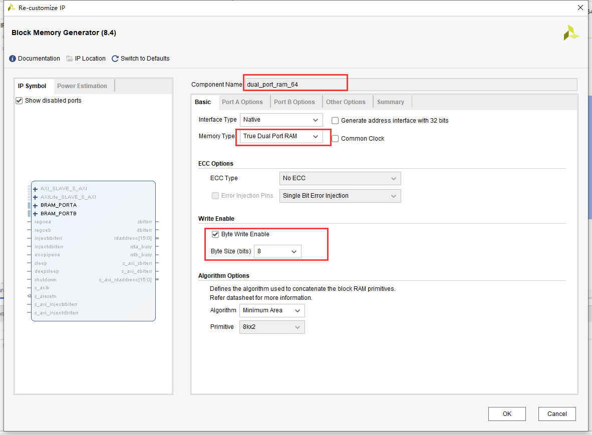
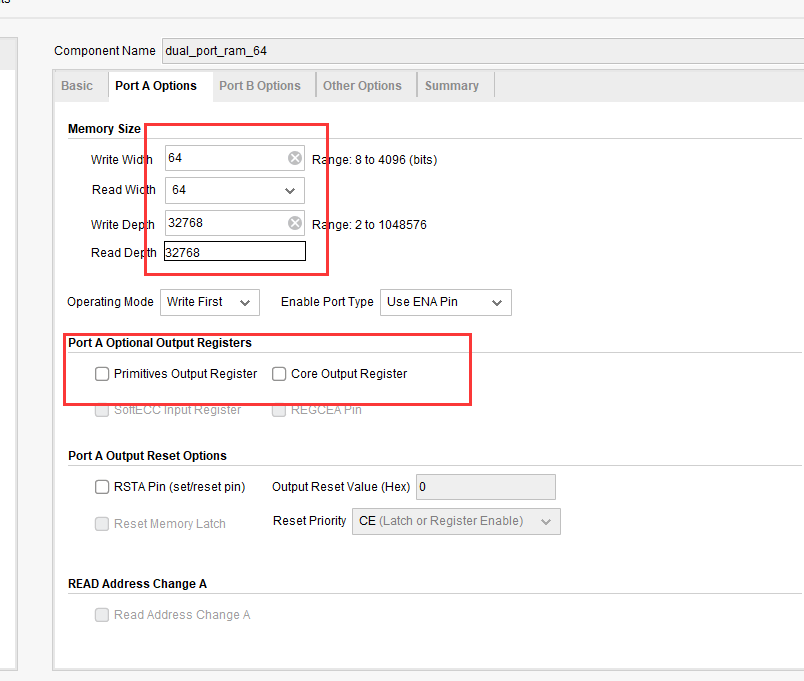
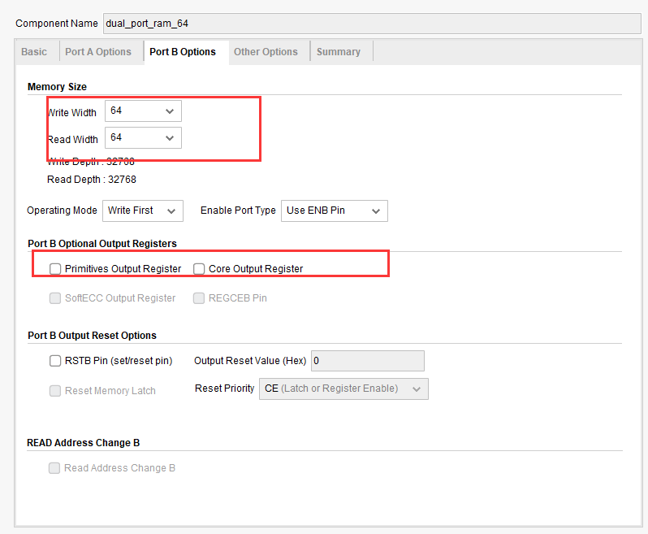
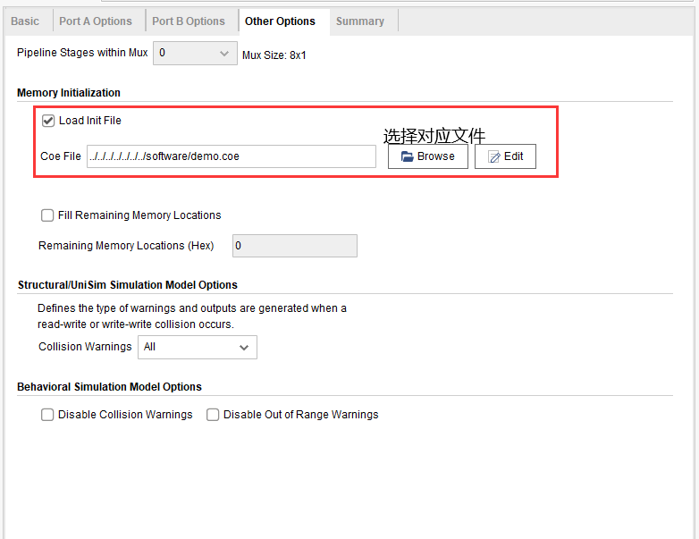
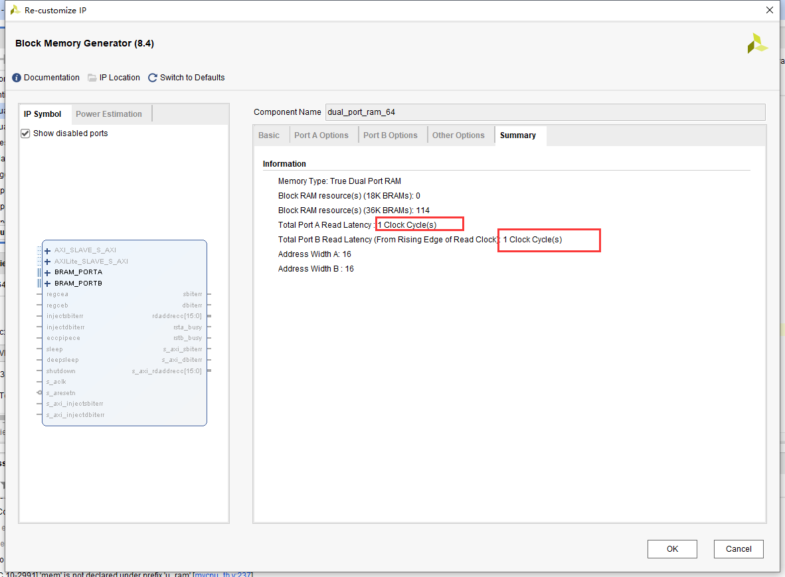
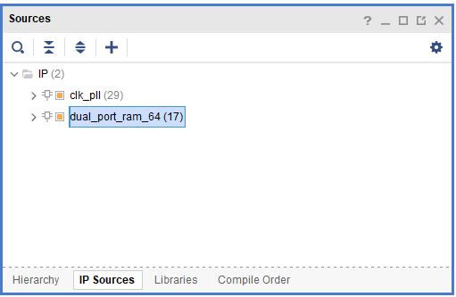

# 基于RISC-V的处理器设计与实现

[项目github地址](https://github.com/neulxf/NEU-IoT-RISCV.git)

## 实验环境：

- 软件：Vivado2019.2（其他版本可以）
- 硬件：Nexys 4 DDR（FPGA开发板）、带有VGA接口的显示器、VGA to VGA的线缆（用于连接FGPA和显示器）
- 测试框架：基于vivado的差分测试框架，用于测试学生设计的处理器实现是否正确

### 测试框架文件结构

NEU-IoT-RISCV

├── README.md       #本文件

├── doc             #参考文件   

├── mycpu           #处理器代码

├── README.assets       #README.md中的图片

├── riscv-test64    #测试用例

└── soc_sram_func   #测试环境

### SoC架构图如下：

### 测试框架使用说明

1. 请将自己的处理器代码置于 __mycpu__ 文件夹下

2. 打开 __NEU-IoT-RISCV\soc_sram_func\run_vivado\mycpu_prj1\mycpu.xpr__ 启动vivado

3. 在vivado中添加 __mycpu__ 文件夹下的代码

4. cpu 顶层模块的模块名应为 __mycpu_top__ , 否则框架文件无法引用你的 cpu 

5. cpu 模块应该具备哪些接口，请阅读 vivado 中调用你的 cpu 模块的顶层模块

5. 测试程序的起始地址为 __0x8000_0000__ ，请让你的 cpu 在复位后从此处读取第一条指令

6. 启动仿真并运行，下方控制台会提示当前进度和错误/通过的信息

7. 如果报错提示 __mycpu__ 和 __reference__ 的结果不一致，请到 __riscv-test64__ 目录下找到 __*test_name*.txt__ 的汇编文件阅读理解程序内容找出错误。

8. 可能出现的错误类型

    |序号|错误形式|可能原因|
    |-|-|-|
    |1|提示中mycpu的pc比reference的pc大|reference所指示的那条指令没有正确写入寄存器|
    |2|提示中mycpu的pc比reference的pc小|mycpu所指示的那条指令本身不应该写入，或其写入值应与寄存器中原来的值相同|
    |3|提示中二者pc相同，但地址/数据不同|当前指令行为错误|
    |4|vivado编译报错|自行查询文档解决，搜索引擎是个好东西|

9. 通过修改 __NEU-IoT-RISCV\soc_sram_func\testbench\mycpu_tb.v__ 中最下方的 __initial__ 模块，可以改变测试的内容。

10. 使用 __unit_test_all__ 测试并通过，即可认为测试完成（但测试完成并不意味着，处理器的设计是完全正确的，只是在当前的测试中没有发现问题）。

12. 测试框架中 __NEU-IoT-RISCV\soc_sram_func\rtl__ 提供了一些基本模块，用于构成SoC，其中的`dual_port_ram_64.v`用于存储指令以及数据

     > dual_port_ram_64的时序为当拍请求，下一拍取到数据，该模块使用Verilog模拟了真双口BRAM的时序行为，仅是为了仿真测试方便，如果上板，则需要将其替换为BRAM IP核，避免FPGA中逻辑资源的浪费

### mycpu_top接口说明

|序号|方向|位宽|信号名|备注|
|-|-|-|-|-|
|1|input|1|clk|时钟信号|
|2|input|1|rst_n|复位信号，低有效|
| 3    | output | 1    | inst_sram_en      | 指令ram 工作使能           |
| 4    | output | 8    | inst_sram_we      | 指令ram 字节写使能         |
| 5    | output | 64   | inst_sram_addr    | 指令ram 地址               |
| 6    | output | 64   | inst_sram_wdata   | 指令ram 写数据             |
| 7    | input  | 64   | inst_sram_rdata   | 指令ram 读数据             |
| 8    | output | 1    | data_sram_en      | 数据ram 工作使能           |
| 9    | output | 8    | data_sram_we      | 数据ram 字节写使能         |
| 10   | output | 64   | data_sram_addr    | 数据ram 地址               |
| 11   | output | 64   | data_sram_wdata   | 数据ram 写数据             |
| 12   | input  | 64   | data_sram_rdata   | 数据ram 读数据             |
| 13   | output | 64   | debug_wb_pc       | wb阶段的指令的pc           |
| 14   | output | 8    | debug_wb_rf_we    | wb阶段发给寄存器组的写使能 |
| 15   | output | 5    | debug_wb_rf_wnum  | wb阶段发给寄存器组的写地址 |
| 16   | output | 64   | debug_wb_rf_wdata | wb阶段发给寄存器组的写数据 |

## 基础条件：

已经成功实现过一个正确的RISC-V 32I 五级流水线处理器内核（计组课设）

## 课题主要内容：

### 基础部分：

- 阅读资源包或者GitHub链接中的README.md文件，学会对测试框架的使用

- 设计一个支持RISC-V 64I指令集的处理器内核，可以将计组课设所设计的RISC-V 32I处理器核升级为RISC-V 64I，即支持64位I型指令集，该过程主要涉及增加一些算术运算指令，将通用寄存器以及处理器中的数据通路从32位需改为64位，访存和取指都将变为64位，地址也将由原来的32位对齐变为64位对齐，这意味着一个周期可以取回两条指令，为了设计简便，可以在两个周期读取相同的64位指令，只是根据PC中低位的不同，选取64位中的高32位或者低32位作为指令

  > - 本课题内容属于机组课设的改进部分，测试框架基本类似，但是因为处理器核由原来的32位变为64位，相应的模块以及测试都进行了适配，具体细节请阅读源码
  > - 关于要增加哪些指令，请阅读指令集手册

- 结合框架中提供的外设（LED灯、拨码开关和VGA）和总线（这里只是一个1x3的桥，用于将访存指令根据地址分发到不同设备），与自己设计的处理器核共同构成一个简单的SoC，将dual_port_ram_64以及vga_dual_port_ram_64模块替换为vivado中提供的Block Memory Generator IP核（BRAM），并将其命名为`dual_port_ram_64`和`vga_dual_port_ram_64`，之后使用提供的软件程序以及显存初始化数据(software\demo.coe和software\neu-img.coe）分别初始化对应BRAM，之后将整个SoC综合生成bit流文件，并烧写至FPGA，通过VGA线缆连接FPGA和显示器，我们将在显示器中看到显示的图像。software/soc_lite_top.bit文件是我们已经实现并综合好的示例，可以烧写到FPGA中观察现象，如果你的实现正确，则现象应该一致

  > 当把dual_port_ram_64替换为IP核的时候，一定要注意，是否造成了和原来模块的冲突，可以disable相应的文件来避免冲突

  

  显示器界面如下所示：
  
  
  
  
  
  
  
  可以看到一个颜色在动态变化的校徽，该现象的原理为:显存中初始化了一个校徽图片，之后软件读取显存中的像素并对其进行修改后重新写入
  
  同时拨动拨码开关，发现对应位置的LED灯也会亮起或熄灭，这也是通过软件来实现的，拨码开关对软件来说属于输入设备，LED灯属于输出设备
  
  

### 进阶部分：

阅读框架中的SoC代码，我们会发现这个SoC中总线（1x3的桥）很简陋，外设也少的可怜，那么我们可以做如下一些改进

- 增加一些自己喜欢的外设，比如按键、RGB LED、数码管、UART等，这意味着我们需要理解这些外设的工作原理，并设计好对应的驱动器，然后将其包装为适合软件控制的形式，并挂载到总线上

  > 我们会发现，SoC中只有一个1x3的桥，无法扩展更多的接口，用来挂载外设，最简单的方式便是将其修改为1x4、1x5的桥
  >
  > 如果实现按键的话，最好进行按键消抖

- 自己构建RISC-V交叉编译工具链，实现编译自己的程序，这样才可以对新挂载的外设进行使用（当然你也可以通过直接写汇编代码来对外设进行测试）

  > 编译后生成的elf文件无法直接写入BRAM，你需要将其转化为二进制（bin）文件，然后将其转换为.coe文件，才可以用于初始化BRAM

- 优化处理器核的设计，使其能够跑在更高的频率（80MHz~100MHz）

  >更好的处理器时序，使得处理器能够运行在更高的频率，性能也会更好

### 扩展部分：

- 将1x3的桥替换为AXI4总线、Wishbone总线或者其他你喜欢的总线，这样我们便可以连接那些别人打包好的基于特定总线接口的外设了

  > 如果想替换为不同的总线，你会发现理解总线协议就是一个不小的挑战，同时你还需要将处理器的访存接口进行包装，来适应新的总线协议

- 你会发现每次修改处理器中的应用都需要对整个SoC重新综合，每次都要花费很长时间，这实在太不优雅了，因此你可以设计一个下载器，用于将程序写入BRAM中，当下载结束后，处理器将自动执行新下载的程序，而无需重新综合整个系统

  > 我们只提供一种下载器的设计思路，你也可以选择其他方式进行实现
  >
  > 设计一个上位机（可以基于Python开发，Python有很多好用的库），实现将编译后的软件程序的bin文件，通过UART输出（可以通过购买一个USB转UART的模块，连接在电脑上），处理器中设计一个接收模块，实现将接收到的数据进行串并转换后写入BRAM，下载结束后，处理器复位并从起始位置开始执行新指令。

## 附录：

- BRAM IP核如何配置(dual_port_ram_64和vga_dual_port_ram_64的配置类似)：

  

  

  

  

  

  综合方式选择out of context，最后结果如下：

  

- 外设的地址（这些信息都可以从框架源码中获得）：

  - 拨码开关的读取地址为`0xbfaf_f020` ，其中低16位分别用于显示16个拨码开关的状态
  - LEDs的写入地址为`0xbfaf_f000` ，其中低16位分别用于控制16个LED
  
- 显存大小为512x512像素，对用的地址为0xC0000000-C0040000，每个像素使用1Byte表示，其中高3位、中间3位和最低2位，分别代表了RGB三个通道的值的高3位、高3位和高2位，剩余位将被赋0。如果想要自己处理图片，请将图片转化成RGB形式，并取RGB对应的高3位、高3位和高2位，通过R+G+B将其组合为一个Byte，因为总线位宽为64，所以一次可以写入8个像素，因此建议一次将8个像素同时写入显存对应位置（请注意地址的处理）。

  > 0xC0000000-0xC0000200为像素的第一行,0xC0000200-0xC0000400为第二行，以此类推

